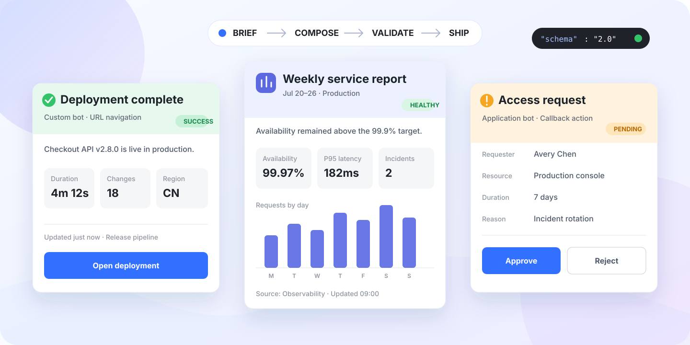

<p align="center">
  
</p>

<h1 align="center">Feishu Card JSON 2.0 Skill</h1>

<p align="center">
  Turn a short brief into a polished, valid, delivery-ready Feishu/Lark card.<br>
  The skill chooses the right delivery surface, composes only supported interactions, and validates the final payload.
</p>

<p align="center">
  <a href="README.zh-CN.md">简体中文</a>
  ·
  <a href="https://open.feishu.cn/document/feishu-cards/card-json-v2-components/component-json-v2-overview?lang=en-US">Official component docs</a>
</p>

<p align="center">
  
  
  
</p>

## Why this skill

Card JSON is easy to produce and surprisingly easy to get wrong. A visually plausible payload can still use a legacy field, attach a callback to a surface that cannot receive it, collapse badly on mobile, or fail strict JSON 2.0 validation.

This skill provides one opinionated path from request to production payload:

- **Delivery-aware** — distinguishes custom-bot webhooks, application bots, callback responses, and CardKit templates before choosing interactions.
- **Composition-aware** — applies compact hierarchy, semantic header themes, responsive columns, dark-mode colors, and one clear primary action.
- **Component-aware** — covers containers, display components, interactive controls, Markdown, tables, charts, images, audio, localization, and streaming.
- **Validation-aware** — checks the 2.0 schema, envelope shape, nesting, IDs, forms, component limits, and common unsupported combinations.
- **Secret-safe** — never requires a webhook URL or signing secret inside a card or source file.

## Quick start

Install the skill:

```bash
npx skills add lageev/feishu_msg_card_skill
```

Then invoke it explicitly in your prompt:

```text
Use $feishu-card-json-v2 to create a deployment-failure notification
for a custom bot webhook. Include the service, environment, error summary,
owner, failure time, and one button that opens the deployment details.
```

The result is a complete JSON 2.0 payload for the selected surface, followed only by the integration notes that matter.

## Example gallery

The repository includes five strict JSON templates. Values that require your data are explicit `${PLACEHOLDERS}`—no invented user IDs, resource keys, metrics, secrets, or webhook URLs.

| Use case | Delivery surface | What it demonstrates | Template |
|---|---|---|---|
| Notification | Custom bot | Semantic header, Markdown summary, metadata columns, URL action | [webhook-notification.json](assets/templates/webhook-notification.json) |
| KPI / status report | Application bot | Fill width, responsive metrics, typed table, quiet metadata | [status-report-card.json](assets/templates/status-report-card.json) |
| Approval / action | Application bot | Callback actions, confirmation, collapsible detail | [application-action-card.json](assets/templates/application-action-card.json) |
| Data collection | Application bot | Form, required fields, submit/reset controls | [application-form-card.json](assets/templates/application-form-card.json) |
| Interaction result | Callback response | Toast plus immediate raw-card replacement | [callback-response.json](assets/templates/callback-response.json) |

<details>
<summary><strong>Minimal custom-bot card</strong></summary>

```json
{
  "msg_type": "interactive",
  "card": {
    "schema": "2.0",
    "config": {
      "update_multi": true
    },
    "header": {
      "template": "green",
      "title": {
        "tag": "plain_text",
        "content": "Deployment complete"
      }
    },
    "body": {
      "padding": "12px",
      "vertical_spacing": "12px",
      "elements": [
        {
          "tag": "markdown",
          "content": "**Checkout API** is live in production."
        },
        {
          "tag": "button",
          "text": {
            "tag": "plain_text",
            "content": "Open deployment"
          },
          "type": "primary_filled",
          "width": "fill",
          "behaviors": [
            {
              "type": "open_url",
              "default_url": "${DETAIL_URL}"
            }
          ]
        }
      ]
    }
  }
}
```

</details>

## JSON 2.0 at a glance

Every raw card follows the same top-level structure. Components live in `body.elements` and declare their type with `tag`.

```json
{
  "schema": "2.0",
  "config": {},
  "card_link": {},
  "header": {},
  "body": {
    "direction": "vertical",
    "padding": "12px",
    "vertical_spacing": "8px",
    "elements": []
  }
}
```

| Family | JSON 2.0 components covered by the skill |
|---|---|
| Containers | `column_set`, `form`, `interactive_container`, `collapsible_panel` |
| Display | `header`, `div`, `markdown`, `img`, `img_combination`, `person`, `person_list`, `chart`, `table`, `audio`, `hr` |
| Interactive | `input`, `button`, `overflow`, `select_static`, `multi_select_static`, `select_person`, `multi_select_person`, `date_picker`, `picker_time`, `picker_datetime`, `select_img`, `checker` |

The recycling container belongs to the visual CardKit builder and cannot be authored as a raw Card JSON component.

## Choose the delivery surface first

The same-looking card can require a different payload and support a different interaction model depending on how it is sent.

| Surface | Output shape | Supported interaction |
|---|---|---|
| Custom bot webhook | `{"msg_type":"interactive","card":{...}}` | Static display and URL navigation |
| Application bot / OpenAPI | Raw card object or the requested API envelope | URL navigation, callbacks, forms, updates |
| Callback response | `toast` plus optional `card.type: "raw"` replacement | Immediate feedback and card replacement |
| CardKit template | Template ID, version, and variables | Template capabilities and CardKit APIs |

> A custom bot is a one-way sender. Use an application bot when the card must collect input, submit a form, receive a callback, update after interaction, or stream content.

## Install options

Interactive install:

```bash
npx skills add lageev/feishu_msg_card_skill
```

Global install, then choose an agent interactively:

```bash
npx skills add lageev/feishu_msg_card_skill -g
```

Global install for Codex without confirmation prompts:

```bash
npx skills add lageev/feishu_msg_card_skill -g -a codex -y
```

Manual Codex install:

```bash
git clone https://github.com/lageev/feishu_msg_card_skill.git \
  ~/.codex/skills/feishu-card-json-v2
```

Restart Codex if the skill is not discovered immediately.

## Validate and package

Validate a raw card, custom-bot envelope, or callback response:

```bash
python3 scripts/validate_card.py path/to/payload.json
```

Select a mode when automatic envelope detection is ambiguous:

```bash
python3 scripts/validate_card.py --mode custom-bot path/to/payload.json
python3 scripts/validate_card.py --mode raw path/to/payload.json
python3 scripts/validate_card.py --mode callback-response path/to/payload.json
```

Wrap a raw card for a custom-bot webhook without sending it:

```bash
python3 scripts/wrap_webhook.py path/to/card.json
```

If signing is enabled, keep the secret in an environment variable:

```bash
python3 scripts/wrap_webhook.py path/to/card.json \
  --secret-env FEISHU_BOT_SECRET
```

The helper prints JSON only. It never sends a request or exposes the secret.

## Production guardrails

- JSON 2.0 requires Feishu client **7.20 or later**; older clients show the header and an upgrade fallback for the body.
- A card supports at most **200 tagged elements/components** and should keep container nesting within five levels.
- JSON 2.0 currently supports shared cards only; `config.update_multi` must be omitted or `true`.
- Card interaction and update lifetime is **14 days**.
- JSON 2.0 rejects unsupported properties instead of silently ignoring them.
- Root `i18n_elements`, the legacy `action` module, and `update_multi: false` are not valid JSON 2.0 patterns.
- Keep webhook URLs, bot/app secrets, callback tokens, private logs, and authorization decisions out of card bodies and source control.

The bundled validator catches common construction errors; it does not replace Feishu server-side validation or client preview.

## Repository map

```text
SKILL.md                    Core decision and construction instructions
agents/openai.yaml          Skill display metadata
assets/readme/              README card previews
assets/templates/           Reusable JSON 2.0 payloads
references/                 Schema, components, recipes, and official sources
scripts/validate_card.py    Focused JSON 2.0 validator
scripts/wrap_webhook.py     Custom-bot envelope/signature helper
```

## Further reading

- [Official JSON 2.0 component overview](https://open.feishu.cn/document/feishu-cards/card-json-v2-components/component-json-v2-overview?lang=en-US)
- [Official JSON 2.0 card structure](https://open.feishu.cn/document/feishu-cards/card-json-v2-structure?lang=en-US)
- [Official JSON 2.0 breaking changes](https://open.feishu.cn/document/feishu-cards/card-json-v2-breaking-changes-release-notes?lang=en-US)
- [Component catalog](references/component-catalog.md)
- [Core schema and style](references/core-schema-and-style.md)
- [Delivery and interaction](references/delivery-and-interaction.md)
- [Design recipes](references/design-recipes.md)

## License

[MIT](LICENSE)
