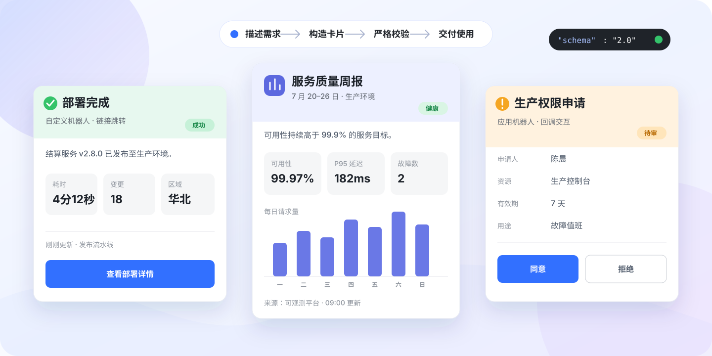

<p align="center">
  
</p>

<h1 align="center">飞书卡片 JSON 2.0 Skill</h1>

<p align="center">
  把一句业务需求，变成精美、合法、可直接集成的飞书卡片。<br>
  Skill 会先判断投递方式，再选择可用组件与交互，并校验最终 Payload。
</p>

<p align="center">
  <a href="README.md">English</a>
  ·
  <a href="https://open.feishu.cn/document/feishu-cards/card-json-v2-components/component-json-v2-overview?lang=zh-CN">飞书官方组件文档</a>
</p>

<p align="center">
  
  
  
</p>

## 为什么需要这个 Skill

卡片 JSON 看起来不复杂，却很容易“能读但不能用”：沿用 1.0 字段、把回调按钮放进不支持回调的自定义机器人、在窄屏上挤成一团，或者因为 JSON 2.0 的严格校验被服务端拒绝。

这个 Skill 提供一条从需求到生产 Payload 的完整路径：

- **识别投递方式**：先区分自定义机器人 Webhook、应用机器人、回调响应与 CardKit 模板，再决定交互能力。
- **组织视觉层级**：按结果、摘要、详情、证据、操作、元信息排版；使用语义化标题色、响应式分栏、深浅色适配和唯一主操作。
- **选择正确组件**：覆盖容器、展示、交互、Markdown、表格、图表、图片、音频、多语言与流式更新。
- **校验完整 Payload**：检查 2.0 Schema、投递外壳、嵌套、ID、表单、组件上限和常见不兼容组合。
- **保护敏感信息**：不会要求把 Webhook 地址或签名密钥写进卡片和代码仓库。

## 快速开始

安装 Skill：

```bash
npx skills add lageev/feishu_msg_card_skill
```

然后在提示词中显式调用：

```text
使用 $feishu-card-json-v2 为自定义机器人 Webhook 创建一张部署失败通知卡片。
需要展示服务名、环境、错误摘要、负责人和失败时间，并提供一个跳转到部署详情的按钮。
```

Skill 会优先返回与投递方式匹配的完整 JSON 2.0 Payload，只补充当前集成真正需要的说明。

## 示例展示

仓库内置 5 个严格 JSON 模板。所有依赖业务数据的值都使用明确的 `${PLACEHOLDER}`，不会虚构用户 ID、资源 Key、指标、密钥或 Webhook 地址。

| 场景 | 投递方式 | 展示能力 | 模板 |
|---|---|---|---|
| 通知卡片 | 自定义机器人 | 语义化标题、Markdown 摘要、元信息分栏、链接按钮 | [webhook-notification.json](assets/templates/webhook-notification.json) |
| KPI / 状态报告 | 应用机器人 | 撑满宽度、响应式指标、类型化表格、弱化元信息 | [status-report-card.json](assets/templates/status-report-card.json) |
| 审批 / 操作卡片 | 应用机器人 | 回调操作、二次确认、折叠详情 | [application-action-card.json](assets/templates/application-action-card.json) |
| 数据采集 | 应用机器人 | 表单、必填项、提交与重置 | [application-form-card.json](assets/templates/application-form-card.json) |
| 交互结果 | 回调响应 | Toast 与原始卡片即时替换 | [callback-response.json](assets/templates/callback-response.json) |

<details>
<summary><strong>查看最小可用的自定义机器人卡片</strong></summary>

```json
{
  "msg_type": "interactive",
  "card": {
    "schema": "2.0",
    "config": {
      "update_multi": true
    },
    "header": {
      "template": "green",
      "title": {
        "tag": "plain_text",
        "content": "部署完成"
      }
    },
    "body": {
      "padding": "12px",
      "vertical_spacing": "12px",
      "elements": [
        {
          "tag": "markdown",
          "content": "**结算服务** 已发布至生产环境。"
        },
        {
          "tag": "button",
          "text": {
            "tag": "plain_text",
            "content": "查看部署详情"
          },
          "type": "primary_filled",
          "width": "fill",
          "behaviors": [
            {
              "type": "open_url",
              "default_url": "${DETAIL_URL}"
            }
          ]
        }
      ]
    }
  }
}
```

</details>

## 一眼看懂 JSON 2.0

每张原始卡片都遵循相同的顶层结构。组件放在 `body.elements` 中，并通过 `tag` 声明类型。

```json
{
  "schema": "2.0",
  "config": {},
  "card_link": {},
  "header": {},
  "body": {
    "direction": "vertical",
    "padding": "12px",
    "vertical_spacing": "8px",
    "elements": []
  }
}
```

| 组件类别 | Skill 覆盖的 JSON 2.0 组件 |
|---|---|
| 容器类 | `column_set`、`form`、`interactive_container`、`collapsible_panel` |
| 展示类 | `header`、`div`、`markdown`、`img`、`img_combination`、`person`、`person_list`、`chart`、`table`、`audio`、`hr` |
| 交互类 | `input`、`button`、`overflow`、`select_static`、`multi_select_static`、`select_person`、`multi_select_person`、`date_picker`、`picker_time`、`picker_datetime`、`select_img`、`checker` |

循环容器属于可视化 CardKit 搭建能力，不能作为原始 Card JSON 组件直接构造。

## 先选投递方式，再谈交互

外观相似的卡片，因为发送方式不同，Payload 外壳和可用交互也会不同。

| 投递方式 | 输出结构 | 支持的交互 |
|---|---|---|
| 自定义机器人 Webhook | `{"msg_type":"interactive","card":{...}}` | 静态展示、链接跳转 |
| 应用机器人 / OpenAPI | 原始卡片对象或指定 API 外壳 | 链接、回调、表单、更新 |
| 回调响应 | `toast` 与可选的 `card.type: "raw"` 替换卡片 | 即时提示、替换卡片 |
| CardKit 模板 | 模板 ID、版本和变量 | 模板能力与 CardKit API |

> 自定义机器人是单向发送者。需要收集输入、提交表单、接收回调、交互后更新或流式输出时，请使用应用机器人。

## 安装方式

交互式安装：

```bash
npx skills add lageev/feishu_msg_card_skill
```

全局安装，然后通过提示选择 Agent：

```bash
npx skills add lageev/feishu_msg_card_skill -g
```

全局安装到 Codex，并跳过确认：

```bash
npx skills add lageev/feishu_msg_card_skill -g -a codex -y
```

手动安装到 Codex：

```bash
git clone https://github.com/lageev/feishu_msg_card_skill.git \
  ~/.codex/skills/feishu-card-json-v2
```

如果 Codex 没有立即发现这个 Skill，请重启 Codex。

## 校验与封装

校验原始卡片、自定义机器人外壳或回调响应：

```bash
python3 scripts/validate_card.py path/to/payload.json
```

自动识别不明确时，显式指定模式：

```bash
python3 scripts/validate_card.py --mode custom-bot path/to/payload.json
python3 scripts/validate_card.py --mode raw path/to/payload.json
python3 scripts/validate_card.py --mode callback-response path/to/payload.json
```

把原始卡片封装成自定义机器人 Webhook Payload，但不发送请求：

```bash
python3 scripts/wrap_webhook.py path/to/card.json
```

启用签名时，把密钥保存在环境变量中：

```bash
python3 scripts/wrap_webhook.py path/to/card.json \
  --secret-env FEISHU_BOT_SECRET
```

封装脚本只输出 JSON，不会发送请求，也不会输出密钥。

## 上线前必须知道

- JSON 2.0 要求飞书客户端 **7.20 及以上**；旧版客户端仅展示标题，正文显示升级提示。
- 单张卡片最多包含 **200 个带 `tag` 的元素或组件**，容器嵌套建议不超过 5 层。
- JSON 2.0 当前仅支持共享卡片，`config.update_multi` 只能省略或设为 `true`。
- 卡片交互与更新有效期均为 **14 天**。
- JSON 2.0 会拒绝不支持的属性，不再静默忽略。
- 根级 `i18n_elements`、旧版 `action` 模块和 `update_multi: false` 都不是合法的 JSON 2.0 用法。
- Webhook 地址、机器人/应用密钥、回调 Token、私有日志和授权结论都不应进入卡片正文或代码仓库。

内置校验器用于发现常见构造错误，不能替代飞书服务端校验与客户端预览。

## 仓库结构

```text
SKILL.md                    核心决策与构造规则
agents/openai.yaml          Skill 展示信息
assets/readme/              README 卡片效果图
assets/templates/           可复用 JSON 2.0 Payload
references/                 Schema、组件、设计方案与官方资料
scripts/validate_card.py    JSON 2.0 专项校验器
scripts/wrap_webhook.py     Webhook 外壳与签名工具
```

## 延伸阅读

- [飞书官方：JSON 2.0 组件概述](https://open.feishu.cn/document/feishu-cards/card-json-v2-components/component-json-v2-overview?lang=zh-CN)
- [飞书官方：JSON 2.0 整体结构](https://open.feishu.cn/document/feishu-cards/card-json-v2-structure?lang=zh-CN)
- [飞书官方：JSON 2.0 不兼容变更与更新说明](https://open.feishu.cn/document/feishu-cards/card-json-v2-breaking-changes-release-notes?lang=zh-CN)
- [组件速查](references/component-catalog.md)
- [核心结构与样式](references/core-schema-and-style.md)
- [投递与交互](references/delivery-and-interaction.md)
- [卡片设计方案](references/design-recipes.md)

## 开源许可

[MIT](LICENSE)
